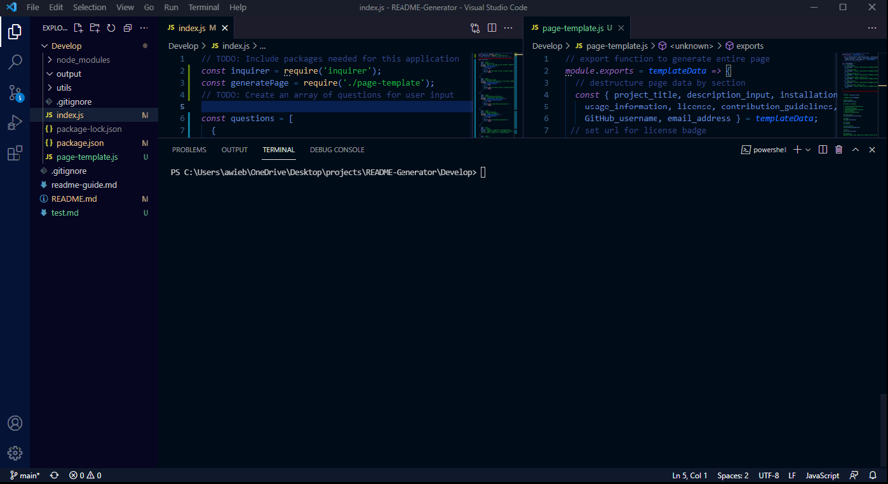

# Node.js Challenge: Professional README Generator

## Description 

Your task is to create a command-line application that dynamically generates a professional README.md file from a user's input using the "Inquirer" package.

## Installation

The Instructional video can be viewed at: https://github.com/AWiebe2021/README-Generator/blob/main/walkthrough.mp4
The projects code can be accessed at: https://github.com/AWiebe2021/README-Generator/

## Screenshot

## Credits
Solo project